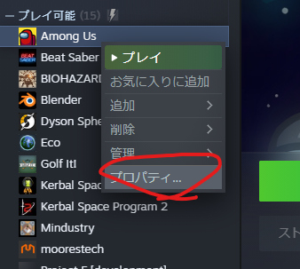

# SuperNewRolesの環境構築

## ※この手順書はAmongUsがCドライブにあることを前提にしています。

Cドライブ以外にインストールしている場合は、AmongUsのみCドライブにインストールしてください。

詳しくは[こちら](https://www.diskpart.com/jp/articles/move-steam-games-to-another-drive.html)

# AmongUs側の設定

### SteamのAmongusを右クリックし、プロパティをクリック

### ローカルファイルから参照をクリック

### [任意] Among Usフォルダをコピーし、Among Us vanillaにリネームする

環境構築が失敗したときなどに改めてSteamからDLしなくていいので、作っておくと便利です。

### ****BepInEx Bleeding Edgeをダウンロードし、導入する****
BepInExはMinecraftで言うForgeのような、Unityのmod開発ライブラリです。

### 注意
BepInExのバージョンはSuperNewRolesが使用しているのバージョンに依存します。
ドキュメントの更新がSNRの更新に追いついていない可能性もあるため、ドキュメントの更新から時間がかかっている場合はバージョンの確認をお願いします。

調べるためには通常通りSuperNewRolesをインストールし、起動後 Among Usインストールフォルダ > BepInEx > LogOutput.log の最初の行でバージョンが確認できます。

[BepInExのサイト](https://builds.bepinex.dev/projects/bepinex_be)から**#669**の**IL2CPP_x86**をダウンロードし、zipを展開してAmong Usフォルダに入れる

### Configを設定する

現在のバージョンではそのまま起動するとエラーが発生します。

`BepInEx/config/BepInEx.cfg` を開き、

UnityLogListening = trueをfalseに設定します。

### 通常通りSteamから起動する

起動に時間がかかる場合があります。

Among Us > BepInEx 内に各種フォルダが生成されていれば成功となります。

### Agartha.dll を導入する

[SNRのRelease](https://github.com/ykundesu/SuperNewRoles/releases)からAgartha.dll をDLし、Among Us > BepInEx > plugins に入れます。

### 開発環境を分けるため、Among UsフォルダをAmong Us SNR devにリネームする

また、マルチプレイ検証の複数立ち上げのために2も作っておくとよい

### リポジトリをクローンする

[https://github.com/TeamKun/SuperNewRolesWithKunLab](https://github.com/TeamKun/SuperNewRolesWithKunLab)

### Visual StudioかRiderで開く

Riderが使えるならおすすめはRider

JetBrainsのライセンスがないなら[Visual StudioのCommunity版](https://visualstudio.microsoft.com/ja/vs/community/)を利用する（未検証）

### SuperNewRolesを実行する

### タイトルがSuperNewRoles with KUN LABと表示されていれば終了

# labmemo検索

コメントで //`labmemo` としているものはlab側のメモなので、検索の参考にしてください

# マルチプレイの検証方法

SNRがはいったアモアスディレクトリをコピペし、「PC以外をキックする」をオフにしたらできた

# 動的なInspector,Hierarchy

BepInEx > plugins にフォルダーを入れる

[https://github.com/sinai-dev/UnityExplorer](https://github.com/sinai-dev/UnityExplorer)

